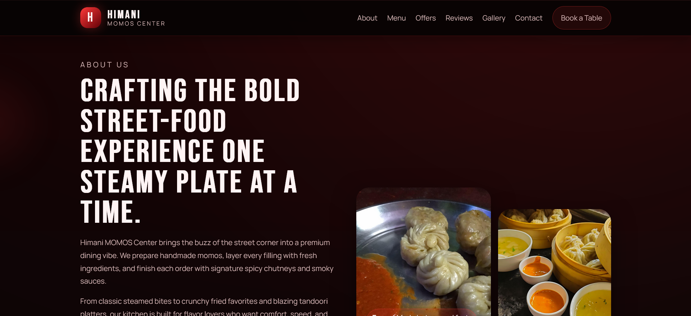
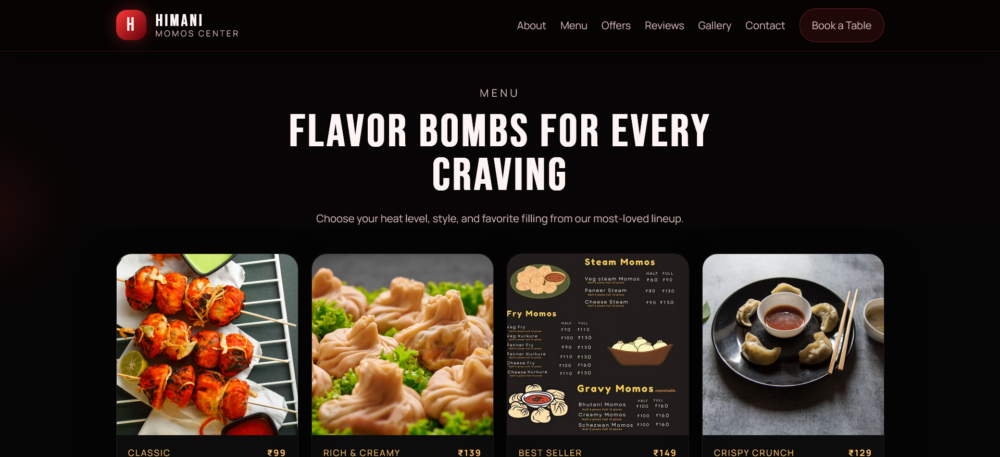
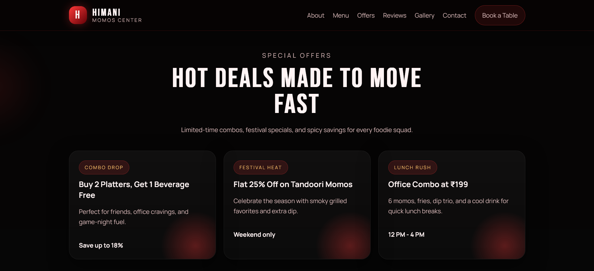
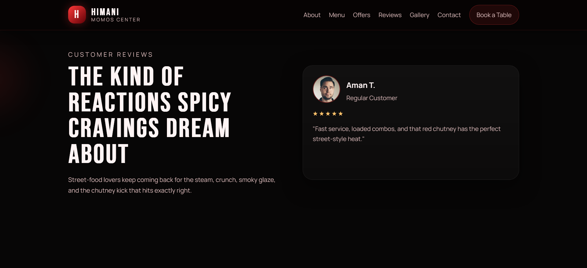
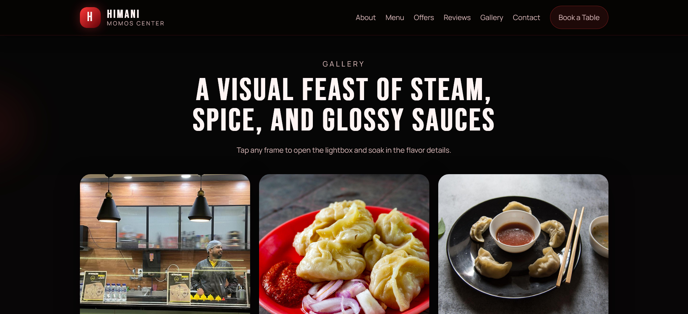
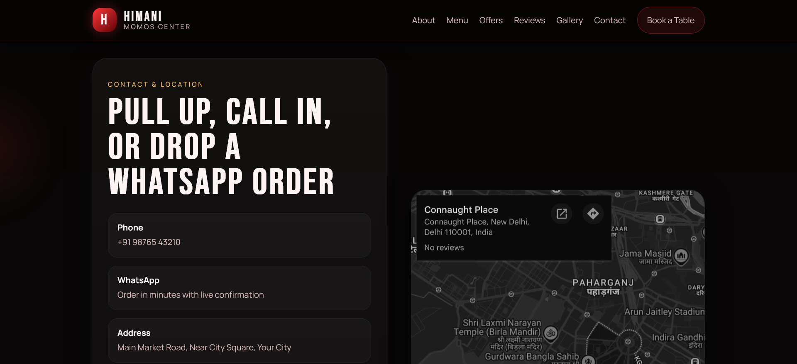

# 🥟 Himani MOMOS Center

A **modern, premium, fully responsive food business website** designed for **Himani MOMOS Center** with a bold **red & black restaurant theme**, smooth animations, and a conversion-focused user experience.

Built to deliver a **premium street-food restaurant vibe** with modern UI, glowing hover effects, motion graphics, and a powerful brand presence.

---

## 🌐 Live Preview

Add your deployed website link here:

```md
https://your-live-website-link.com
```

---

## 📸 Website Preview

## 📸 Website Preview

### Full Website Screenshot


### About Section


### Menu Section


### Offers Section


### Reviews Section


### Gallery Section


### Contact Section


---

## ✨ Features

- 🔥 Premium red & black restaurant theme
- 🥟 Modern street-food brand design
- 📱 Fully responsive (mobile + desktop)
- ✨ Smooth scroll animations
- 🌫️ Steam / smoke visual effects
- 🌶️ Floating spice particle effects
- 🎯 Conversion-focused CTA buttons
- 🍽️ Animated food menu cards
- 💫 Glowing hover effects
- 🎠 Testimonial slider
- 🖼️ Animated gallery section
- 📍 Google Maps integration
- 📞 WhatsApp order CTA
- ⚡ Fast loading & optimized performance
- 🔍 SEO friendly structure

---

## 🧩 Website Sections

### 🏠 Hero Section
- animated banner
- CTA buttons
- food highlights
- steam effects

### 📖 About Us
- brand story
- handmade fresh momos
- premium street-food experience

### 🍽️ Menu
- Veg Momos
- Paneer Momos
- Chicken Momos
- Fried Momos
- Tandoori Momos
- Cheese Momos
- Combo Meals
- Beverages

### 🎁 Special Offers
- combo deals
- festive discounts
- lunch offers

### ⭐ Reviews
- customer testimonials
- star ratings
- sliding review cards

### 🖼️ Gallery
- food images
- restaurant visuals
- lightbox effect

### 📍 Contact
- map
- address
- phone
- WhatsApp order
- contact form

---

## 🛠️ Tech Stack

- **HTML5**
- **CSS3**
- **JavaScript**
- **Responsive Design**
- **GSAP / Framer Motion**
- **Modern UI Animations**

---

## 🎨 Design Theme

```text
Primary Colors:
- Deep Red
- Black
- White accents
```

Premium restaurant branding inspired by modern food websites.

---

## 🚀 Installation

Clone the repository:

```bash
git clone https://github.com/your-username/himani-momos-center.git
```

Open the project folder:

```bash
cd himani-momos-center
```

Run locally:

```bash
open index.html
```

or use Live Server in VS Code.

---

## 📱 Responsive Design

Optimized for:

- Desktop 💻
- Tablet 📱
- Mobile 📲

---

## 💡 Project Goal

To create a **premium digital presence for a street-food restaurant business** that increases customer engagement and online orders.

---

## 👨‍💻 Author

**Your Name**

GitHub: `@yourusername`

---

## 📄 License

This project is open-source and available under the **MIT License**.
